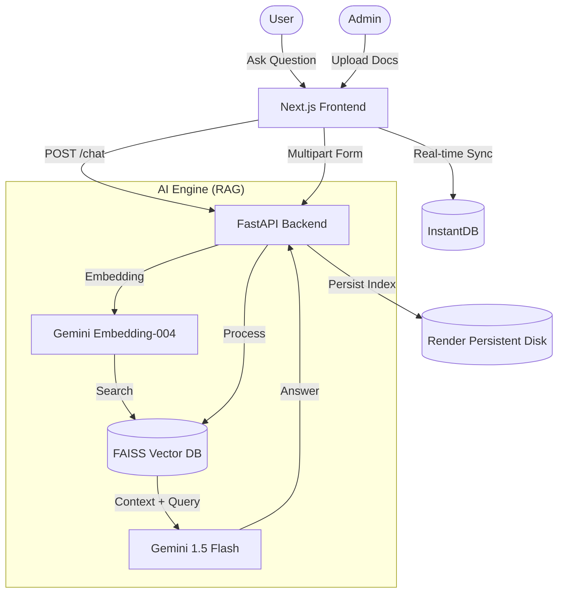

# Admission RAG Chatbot Platform — Project Documentation

A professional, AI-powered platform designed to automate college admission queries using **Retrieval-Augmented Generation (RAG)**. This document provides a comprehensive technical and functional overview of the project.

---

## 1. Executive Summary

The **Admission RAG Chatbot Platform** is a full-stack AI application that enables educational institutions to provide instant, accurate, and context-aware answers to admission-related queries. By leveraging **Google Gemini** and **LangChain**, the platform grounding its responses in official institution documents (PDFs, brochures, fee structures), virtually eliminating hallucinations and ensuring high-trust interactions.

---

## 2. Core Features

### 🤖 RAG-Powered Chatbot
- **Contextual Accuracy**: Answers are grounded specifically in the uploaded documents for each college.
- **Domain Filtering**: Built-in logic to handle off-topic queries gracefully, focusing only on admissions, fees, and courses.
- **Source Attribution**: Provides the filenames used as context for transparency.

### 📁 Dynamic Knowledge Base
- **Multi-Format Ingestion**: Supports `.pdf`, `.txt`, and `.md` files.
- **Instant Processing**: Documents are chunked, embedded, and indexed into a vector database in seconds.
- **Multi-Tenant Support**: Separate vector indices for different colleges/institutions.

### 📊 Admin Dashboard
- **Real-time Stats**: Track the number of active colleges, total documents ingested, chats handled, and leads captured.
- **Lead Capture System**: A dedicated modal to collect prospective student information (Name, Phone, Course) which is stored in real-time.
- **Analytics**: Identify "unanswered" queries where the AI couldn't find a match, highlighting gaps in the documentation.

---

## 3. Technical Architecture



---

## 4. Technology Stack

### Frontend
- **Framework**: Next.js 15+ (App Router)
- **Styling**: Tailwind CSS 4
- **Animations**: Framer Motion (Smooth transitions, micro-interactions)
- **Icons**: Lucide React
- **Database (Client-side)**: InstantDB (Auth, Real-time Graph Database)

### Backend
- **Framework**: FastAPI (Python 3.10+)
- **ORCHESTRATION**: LangChain
- **Vector Database**: FAISS (Facebook AI Similarity Search)
- **LLM & Embeddings**: Google Gemini AI Studio (1.5 Flash & Text-Embedding-04)

---

## 5. API Specification

| Endpoint | Method | Description |
| :--- | :--- | :--- |
| `/chat` | `POST` | Processes a student query using the RAG pipeline. |
| `/ingest` | `POST` | Uploads and indexes new documents/brochures. |
| `/colleges` | `GET` | Lists all colleges currently in the system with metadata. |
| `/health` | `GET` | System health and version check. |
| `/ingest/{id}`| `DELETE` | Removes the knowledge base for a specific college. |

---

## 6. Setup & Installation

### Backend Setup
1. Navigate to `/backend`.
2. Install dependencies: `pip install -r requirements.txt`.
3. Configure `.env`:
   ```env
   GEMINI_API_KEY=your_key_here
   ALLOWED_ORIGINS=http://localhost:3000
   ```
4. Run: `uvicorn app.main:app --reload`.

### Frontend Setup
1. Navigate to `/frontend`.
2. Install dependencies: `npm install`.
3. Configure `.env.local`:
   ```env
   NEXT_PUBLIC_API_URL=http://localhost:8000
   NEXT_PUBLIC_INSTANTDB_APP_ID=your_app_id
   ```
4. Run: `npm run dev`.

---

## 7. Deployment Strategy

### Infrastructure
- **Frontend**: Deployed on **Vercel** with automatic CI/CD.
- **Backend**: Deployed on **Render** (as a Docker service).
- **Persistence**: Render **Persistent Disk** is mounted at `/app/db` to ensure FAISS indices survive server restarts.

### Environment Requirements
- **Gemini API Key**: Required for embeddings and LLM generation.
- **InstantDB ID**: Required for real-time lead capture and dashboard sync.

---

## 8. Future Roadmap
- **Voice Integration**: Direct voice-to-chat capabilities for better accessibility.
- **Advanced Analytics**: Sentiment analysis on student queries.
- **Automated Email Follow-ups**: Integration with SendGrid/Nodemailer for captured leads.
- **Admin Document Preview**: Ability to view and delete specific document chunks within the dashboard.

---
*Generated by Antigravity AI - 2026*
